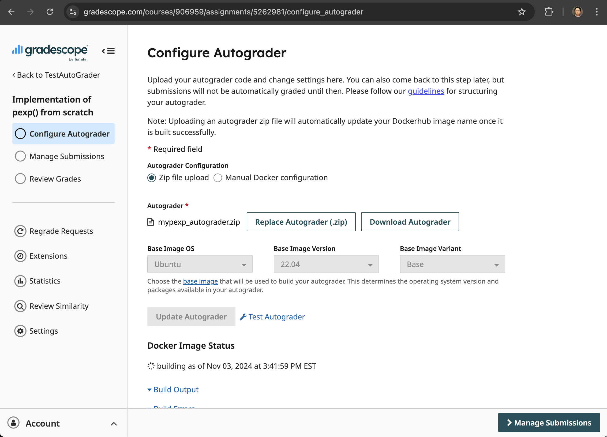
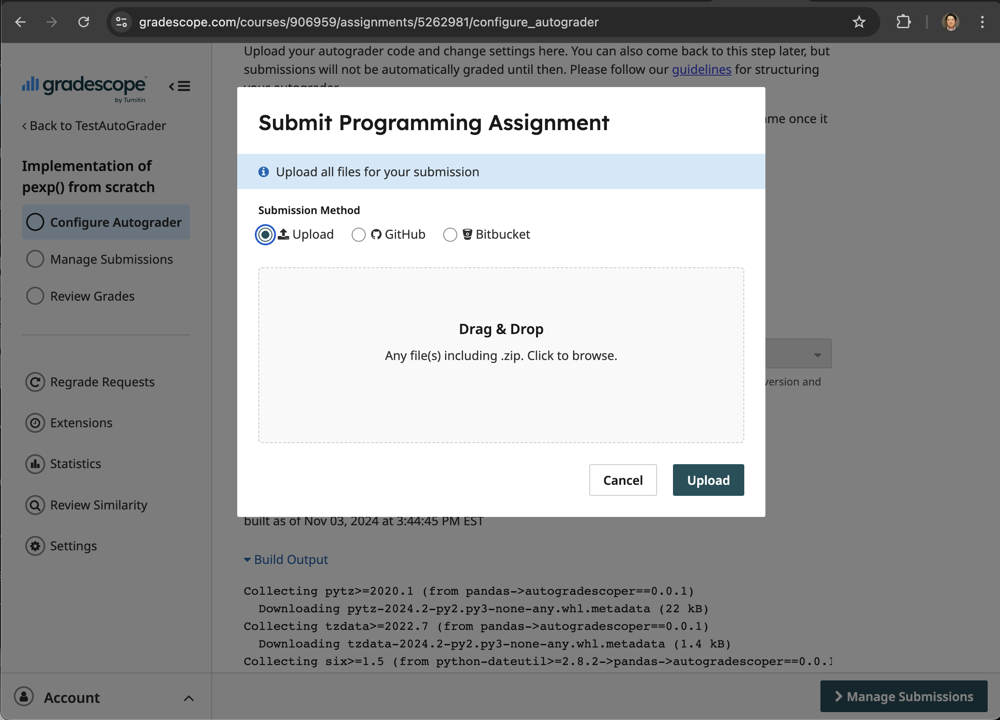

# Testing Gradescope Autograder

## Overview

This section provides a step-by-step guide to test the Gradescope Autograder prepared for the `autogradescoper` toolkit.

### Creating a zip file for Autograder

To create a zip file for the autograder, you need to create a zip file that contains all the files and directories in the structure given previously:

```plaintext linenums="1"
|-- setup.sh
|-- run_autograder
|-- config/
| |-- config.yaml
| |-- config.prob.yaml
| `-- preload.baseonly.R
|-- solution/
| `-- [function_name].R 
`-- args/
  |-- test.1.args
  |-- test.2.args
  |-- ...
  `-- test.10.args
```

If you have multiple problems in a single assignment, the structure of the zip file may change accordingly.

It is important NOT to include the parent directory in the zip file. When compressed, these files should NOT be contained in another directory.


## Upload your Autograder file

After downloading the autograder file, you can upload the file to the Gradescope to set up the autograder for the programming assignment as shown in the following screenshot.



Note that it will typically take a few minutes to build the autograder from the uploaded file. 
If the autograder is successfully built, 
under the "**Docker Image Status**" section, you can see "built as of (Date and time)" message.

## Test your Autograder

You can test the autograder file by selecting "Test Autograder" link after the build is completed, which will shown the following screenshot to allow you to upload a test submission.



There are three example answers you can download and submit at the [GitHub repository](https://github.com/hyunminkang/autogradescoper/tree/main/examples/mypexp/example_answers){:target="_blank"}. All files are named as `mypexp.R`. You can drag and drop the downloaded file to submit a file for testing.

For example, if you submit the correct answer under `v1_correct/mypexp.R`, you will see the following screenshot, showing that the test is passed with the full score.


If you finished until this step, you are ready to set up your own programming assignments for students.
Please see [Use Cases](use_cases/example_assignment.md) section for the detailed explanation of how to prepare your own Autograder for your class.