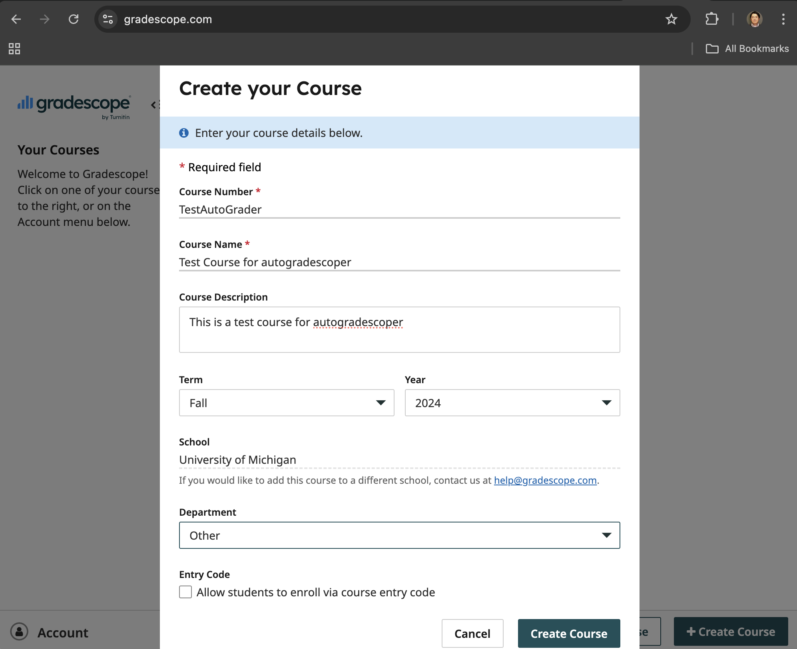
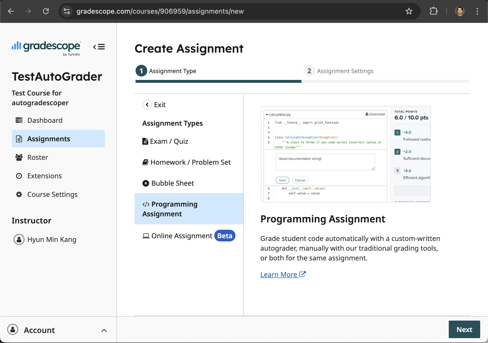
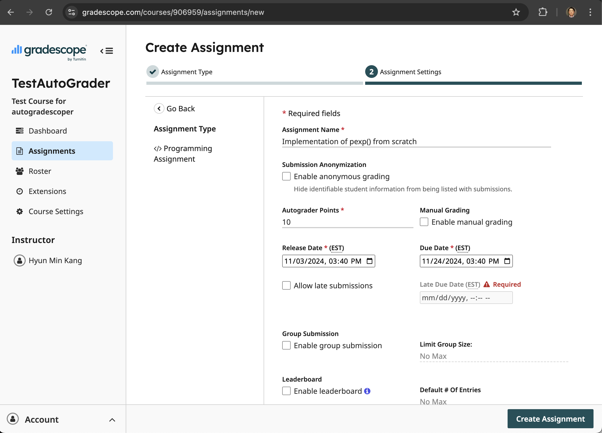
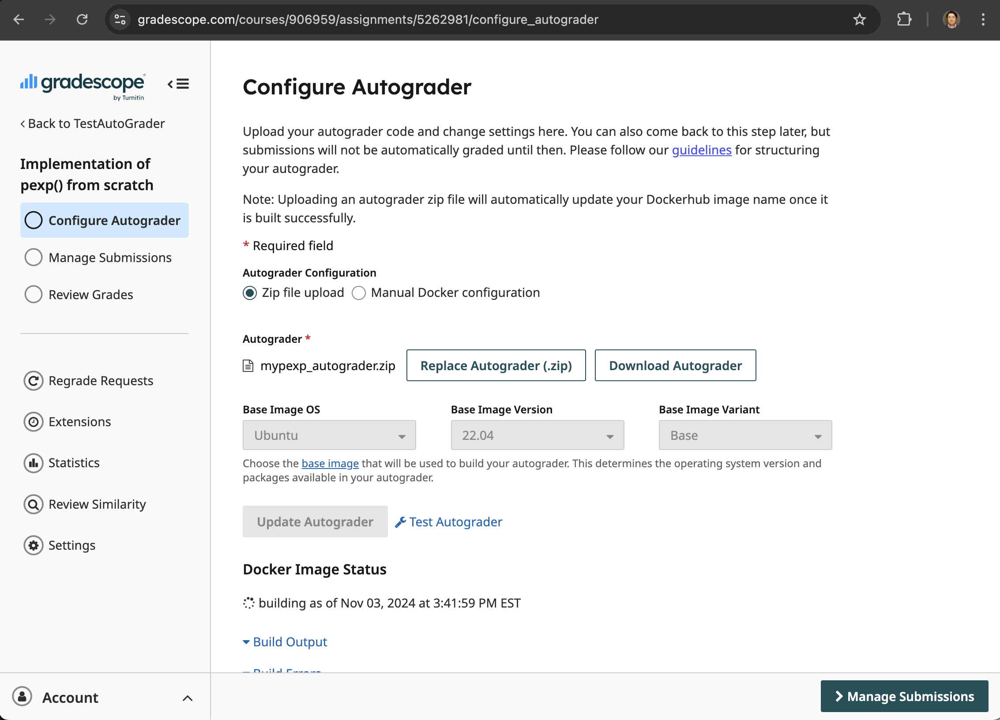
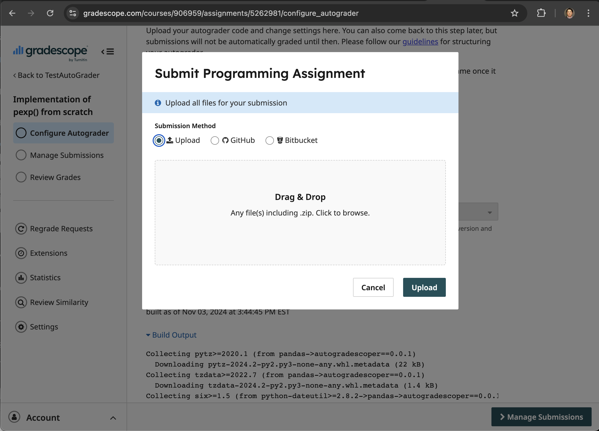
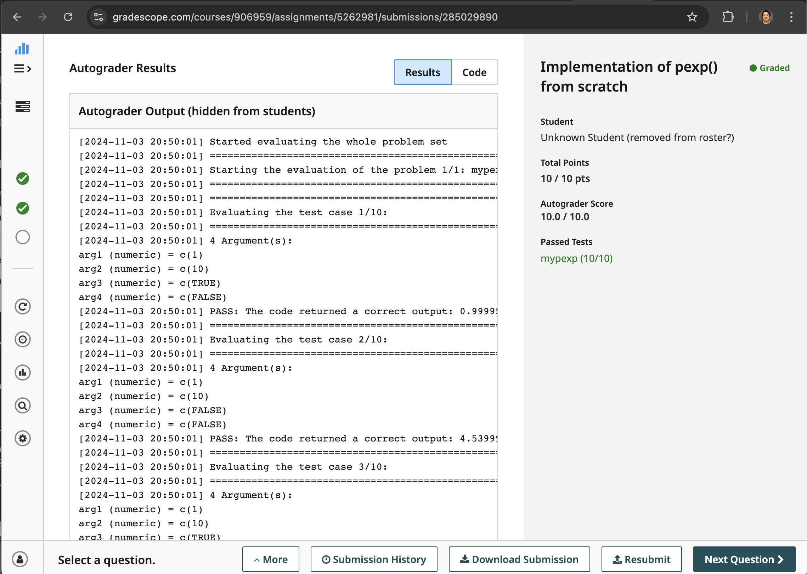

# Quickstart for autogradescoper

## Overview

To use `autogradscoper` for your course, you do not need to install the software on your local machine. However, you must have a valid account that allows you to create a programming assignment in Gradescope. Please see the [List of Schools](https://www.gradescope.com/saml){:target="_blank"} that support single-sign-on (SSO) with Gradescope.

Here, we will use a prepared example to autograde an R programming assignment that reproduces the `pexp()` function in R using only the `base` package. Here are the basic steps to get started with the example:

1. Create an account or log in to Gradescope.
2. Create a course in Gradescope.
3. Create a programming assignment in Gradescope.
4. Upload your Autograder file.
5. Test your Autograder file.
6. Release the programming assignments to students.

## Create an account or log in to Gradescope

Please visit the [Gradescope Login Page](https://www.gradescope.com/login){:target="_blank"} to create an account or log in. Instructors will likely need to use their school email address to create an account or sign in.

## Create a course in Gradescope

You can create a new course by selecting the "+Create Course" button from the dashboard, as shown below.

## Create a programming assignment in Gradescope

You can create a new programming assignment by selecting the "Create Assignment" button from the course dashboard. When selecting Assignment Type, choose "Programming Assignment," as shown below.

Next, specify the Assignment Settings by providing an Assignment Name, Total Points (use 10 in this example), Release Date, and Due Date, as shown below.

## Download the Example Autograder file

You can download the example autograder file from the [GitHub repository](https://github.com/hyunminkang/autogradescoper/blob/main/examples/mypexp_autograder.zip){:target="_blank"}. 

You may click the [following link](https://github.com/hyunminkang/autogradescoper/raw/refs/heads/main/examples/mypexp_autograder.zip) to download the autograder file (5.6 KB) directly to your local computer.

To understand the details of the example autograder file, please see the [Use Cases](use_cases/example_assignment.md) section for a detailed explanation.

## Upload your Autograder file

After downloading the autograder file, you can upload it to Gradescope to set up the autograder for the programming assignment, as shown in the following screenshot.

Note that it will typically take a few minutes to build the autograder from the uploaded file. If the autograder is successfully built, under the "**Docker Image Status**" section, you will see a "built as of (Date and time)" message.

## Test your Autograder

You can test the autograder file by selecting the "Test Autograder" link after the build is completed, which will show the following screenshot to allow you to upload a test submission.

There are three example answers you can download and submit from the [GitHub repository](https://github.com/hyunminkang/autogradescoper/tree/main/examples/mypexp/example_answers){:target="_blank"}. All files are named `mypexp.R`. You can drag and drop the downloaded file to submit it for testing.

For example, if you submit the correct answer under `v1_correct/mypexp.R`, you will see the following screenshot, showing that the test passed with a full score.

If you have completed this step, you are ready to set up your own programming assignments for students. Please see the [Use Cases](use_cases/example_assignment.md) section for a detailed explanation of how to prepare your own Autograder for your class.
